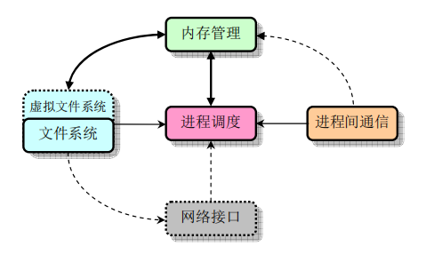
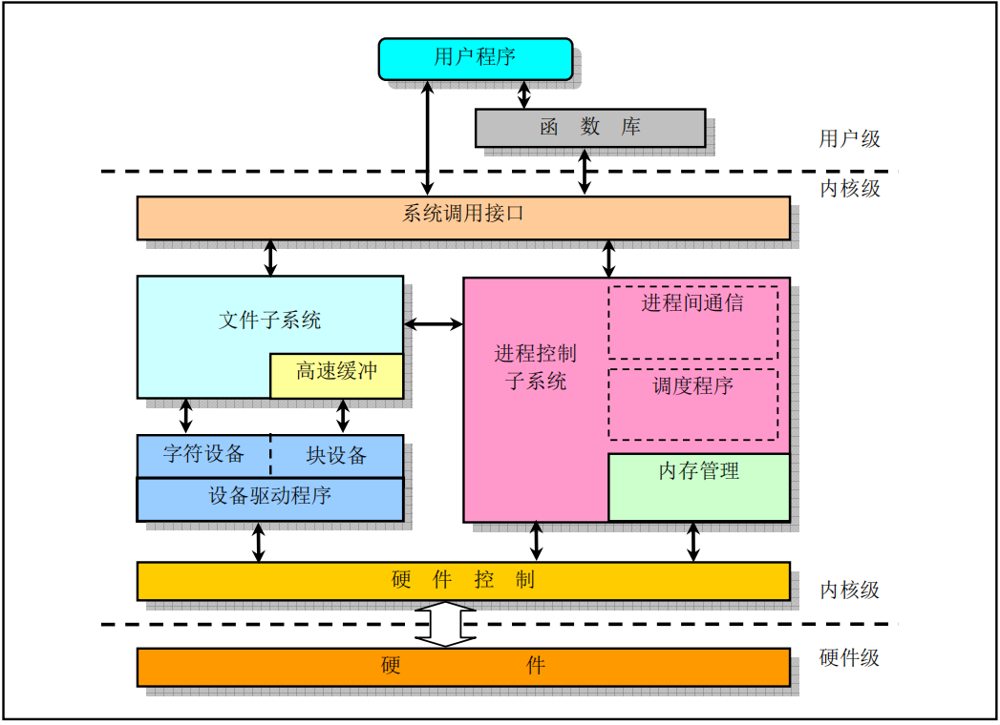
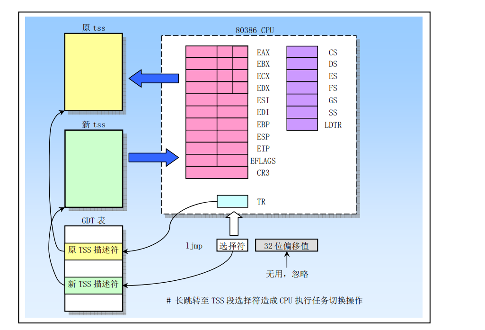
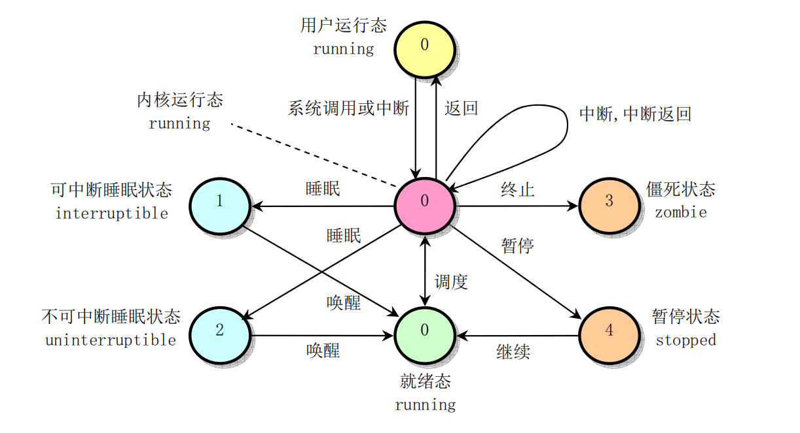
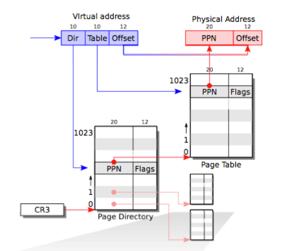
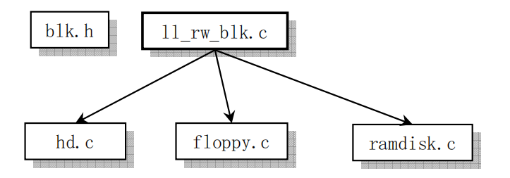

# LiNos
## My re-write of the linux OS 0.11-version

## Developing Environment 
    - Windows10
    - bochs 2.6.11
    - NASM 2.11.02.exe
    - rawrite2.0

## All the files
- /boot   *all the flies that controls the bootup*
- /fs   *all the files that related to the filesystem*
- /include  *xx.h files*
- /init *init the OS and run main.c*
- /kernel   *all the system_call*
- /lib  *lib files*
- /mm   *all the files to manage memory*
- /tools    
- Makefile

## Note
    Makefile calls up all the makefile in the directories and make them together to get the LiNOS

## /boot/bootsect.S
    add some function to get a better debug experience
    such as:
        print_ln
        print_hex
    chang some ungly writing style in linux-0.11 such as mov ax,#0  -> xor ax, ax
    when failing to kill_driver_motor, now I printed the status of the dirver

## [TO DO LIST]
    [] implement buddy system
    [] fix the xv6 & ucore together
    [] rewrite the file system
    [] add GUI
    [] add Network Protocol Stack
    [] maybe rewrite it in Rust
    
## Now I have read the source code of the Linux Kernel v0.11 
* And I'm going to start the OS Writing *

* If I have enough time, I will write a detailed turtorials to talk about the way to write a personal toy system

## LiNos Design Target
# 

## Kernel Structure
# 

## Boot
# .png)

## TSS
# 

## Mode Transformation
# 

## Process
# 

## Memory Management
# 

## Device
# 
# 

