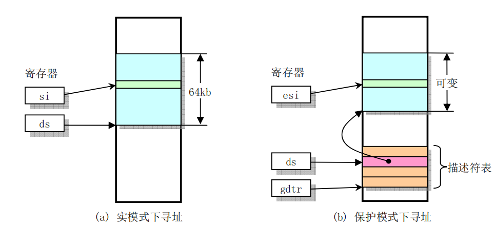

# LiNos
## My OS combined with ucore and linux

## Developing Environment 
    - Windows10
    - bochs 2.6.11
    - NASM 2.11.02.exe
    - rawrite2.0

## All the files
- /boot   *all the flies that controls the bootup*
- /fs   *all the files that related to the filesystem*
- /include  *xx.h files*
- /init *init the OS and run main.c*
- /kernel   *all the system_call*
- /lib  *lib files*
- /mm   *all the files to manage memory*
- /tools    
- Makefile

## Note
    Makefile calls up all the makefile in the directories and make them together to get the LiNOS

### */boot/bootsect.S*
    add some function to get a better debug experience
    such as:
        print_ln
        print_hex
    chang some ungly writing style in linux-0.11 such as mov ax,#0  -> xor ax, ax
    when failing to kill_driver_motor, now I printed the status of the dirver

### */boot/setup.s*
    add some fucntion to get a better debug experience

### */boot/head.s*
    add some fucntion to get a better debug experience

### */init/main.c*
    

## [TO DO LIST]
    [] implement buddy system
    [] fix the xv6 & ucore together
    [] rewrite the file system
    [] add GUI
    [] add Network Protocol Stack
    [] maybe rewrite it in Rust
    
## Now I have read the source code of the Linux Kernel v0.11 
* And I'm going to start the OS Writing *

* If I have enough time, I will write a detailed turtorials to talk about the way to write a personal toy system

## AT&T 
AT&T:   immed32(basepointer, indexpointer, indexscale)
imm32 + basepointer + indexpointer × indexscale
寄存器命名必带%
AT&T: movl $_value, %ebx 

顺序从前到后
AT&T: movl %eax, %ebx

直接寻址
AT&T:  foo

寄存器间接寻址 
AT&T: (%eax)

变址寻址 
AT&T: _variable(%eax)               
AT&T: _array( ,%eax, 4)            
AT&T: _array(%ebx, %eax,8)

## 内敛汇编 inline asm statements
基本内联汇编语句（basic inline asm statement)和扩展内联汇编语句（extended inline asm statement）

如果有多行汇编，则每一行都要加上 "\n\t"。其中的 “\n” 是换行符，"\t” 是 tab 符，在每条命令的 结束加这两个符号，是为了让 gcc 把内联汇编代码翻译成一般的汇编代码时能够保证换行和留有一定的空格

## volatile
一些寄存器或者串口变量值会随时变化,volatile 的意思是让编译器每次操作该变量时一定要从内存中真正取出
Debug模式下，编译器不会对代码进行优化，输出结果正确
Release模式下，结果错误

volatile用在如下的几个地方：

1) 中断服务程序中修改的供其它程序检测的变量需要加 volatile；
2) 多任务环境下各任务间共享的标志应该加 volatile；
3) 存储器映射的硬件寄存器通常也要加 volatile 说明，因为每次对它的读写都可能由不同

volatile指针
和 const 修饰词类似，const 有常量指针和指针常量的说法，volatile 也有相应的概念：
数据const，指针指的对象
const char* cpch;
volatile char* vpch;

地址，或者说指针自身的值
char* const pchc;
char* volatile pchv;

(1) 可以把一个非volatile int赋给volatile int，但是不能把非volatile对象赋给一个volatile对象。
(2) 除了基本类型外，对用户定义类型也可以用volatile类型进行修饰。
(3) C++中一个有volatile标识符的类只能访问它接口的子集，一个由类的实现者控制的子集。用户只能用const_cast来获得对类型接口的完全访问。此外，volatile向const一样会从类传递到它的成员。

多线程下volatile
当两个线程都要用到某一个变量且该变量的值会被改变时，应该用 volatile 声明，该关键字的作用是防止优化编译器把变量从内存装入 CPU 寄存器中
如果变量被装入寄存器，那么两个线程有可能一个使用内存中的变量，一个使用寄存器中的变量，这会造成程序的错误执行

## LiNos Design Target
# 

## Kernel Structure
# 

## /init
### /init/main.c
### kern_init()
#### console初始化： cga_init -> serial_init -> kbd_init
#### 打印message
#### 打印内核信息 print_kerninfo() 打印内核信息，内核初始化，然后代码段，数据段的位置，内核可执行地址空间
#### 物理内存初始化，pmm_init()
#### 初始化中断 pic_init(), 中断描述符表初始化 idt_init()
#### 虚拟内存初始化，vmm_init()
#### 调度器初始化， sched_init()
#### 初始化进程表 proc_init()
#### 磁盘初始化，包括ide,swap区，文件系统初始化
#### 时钟初始化， intr使能，运行idle_process()

### print_cur_status
#### 打印目前段寄存器的状态

### switch_to_user/kernel
#### 切换到用户态和内核态

## /driver/console.c
### cons_init(), cga初始化，指向内核基址+CGA缓冲区大小偏移的指针，设置0xA55A, 提取cursor位置
### serial_init, 关闭FIFO，设置speed，DLAB latch， modem controls, 使能rcv中断， 清除已经存在的标志和中断，如果串口存在，就使能中断
### 排干keyboard缓冲区，然后打开键盘输入，使能中断
### kdb_proc_data获取从键盘中得到的输入，然后如果开了Ctrl，Shift,Esc,CAPSLOCK怎么处理，还有设置快捷键Ctrl-Alt-Del 重启
### 其他的函数包括从串口获取，键盘获取字符，以及如何输出到console，从console获取字符

## Boot
# .png)
## ucore boot

#### asm.h 汇编宏，用来创建x86段， 设置正常段SEG_NULLASM，段设置(type, base, lim)类型，段类型 可执行，不可执行，只可执行，可写不可执行段，可读可执行段，可获得

#### bootasm.S 打开CPU，切换到32位保护模式，进入C代码，BIOS将代码从硬盘第一个扇区导入内存0x7c00并且开始在实模式下执行，cs:eip = 0:7c00
#### 设置内核代码段选择子，数据段选择子，打开保护模式，设置SMAP

#### 从开始地址运行bootloader
#### 关中断，cld字符串运算自增，设置DS，ES，SS段寄存器位0
#### seta20.1 等待A20芯片引脚，当0x64端口未准备好，就不停检测，然后将0xd1输出到64端口
#### seta20.2 同理，60端口
#### probe_memory->start_probe->cont->finish_probe 检测内存分布
#### 然后切换到保护模式，使用GDT和段转换机制，使得虚拟地址等效于物理地址，以至于等效内存映射在转换过程中不会改变
#### load gdt gdtdescriptor 装入gdt段描述符
#### 取出cr0 到 eax
#### 将保护模式位 CR0_PE_ON 置 1，并且运行在特权级0中，在设置该比特位后，随后一条指令必须是一条段间跳转指令以用于刷新CPU当前指令队列。因为原来的指令是实模式指令，现在失效
#### ljmp 跳到下一个指令，32位代码段，处理器转换到32位模式段选择子
#### .code32 代码段 protcseg
#### 设置保护模式下的数据段寄存器，将数据段选择子放入ax->ds,es,fs,gs,ss
#### 设置栈指针，进入c代码bootmain，栈基址0x0，栈顶指针esp 0x7c00 调用bootmain
#### 如果bootmain异常返回，那么重新启动
#### 最后.data 中设置GDT .p2align 2 两字对齐
#### gdt: 设置bootloader和kernel的代码段，数据段
#### gdtdesc: 设置gdt段描述符

# bootmain.c bootloader 将ELF格式的内核镜像从第一个IDE装入内存

# 在硬盘上，这段代码分布在第一扇区，第二扇区开始保存内核镜像，ELF格式
# BOOTUP 步骤， 当CPU将BIOS装入内存，BIOS初始化设备，设置中断，然后读第一个区上的bootloader
# bootmain.c调用bootmain()函数

# 扇区大小512字节， 0x55AA结尾
# 定义ELF头的空间 
# waitdisk等待硬盘准备完毕，readsect读一个扇区到dst， 读一个段offset偏置的count字节到虚拟地址
# bootmain函数，bootloader的entry，然后读内核镜像第一页，然后判断它满不满足ELF格式，将程序段导入，调用指针
# 如果出错，outw

## linux-0.11 boot

### bootsect.s 
####     ! 头文件linux/config.h中定义了内核用到的一些常数符号和Linus自己使用的默认硬盘参数块。
####    ! 例如其中定义了以下一些常数：
####    ! DEF_SYSSIZE  = 0x3000 - 默认系统模块长度。单位是节，每节为16字节；
####    ! DEF_INITSEG  = 0x9000 - 默认本程序代码移动目的段位置；
####    ! DEF_SETUPSEG = 0x9020 - 默认setup程序代码段位置；
####    ! DEF_SYSSEG   = 0x1000 - 默认从磁盘加载系统模块到内存的段位置

#### bootsect.s被BIOS装入0x7c00，然后将他自己移动到0x90000，然后自己跳转到那
#### 然后在0x90200接着 导入setup代码，系统导入到0x10000，使用 BIOS中断完成
#### .globl begtext, begdata. begbss, endtext, enddata, endbss
#### ENDSEG = SYSSEG + SYSSIZE
#### 根文件系统设备号ROOT_DEV和交换设备号SWAP_DEV 现在由tools目录下的build程序写入
#### ! 设备号 = 主设备号*256 + 次设备号
#### ! 1-内存， 2-磁盘， 3-硬盘， 4-ttyx, 5-tty, 6-并行口, 7-非命名管道
#### 设置BIOS中断参数表，然后利用ROM里面BIOS的中断INT 13 将setup从第二个扇区开始的四个扇区读入到0x90200
#### 装载结束之后，打印一些启动信息，然后将system模块加载到64KB 0x10000的地方，然后跳到setup程序段开始执行

#### setup.s 询问bios有关内存/磁盘/其他参数，并将这些参数放到一个安全的地方
#### 利用BIOS中断0x15 功能号ah = 0x88 取系统所含扩展内存大小并保存在内存0x90002处
#### 利用BIOS中断0x10 检查显示方式（EGA/VGA）并取参数
#### 复制硬盘参数表2个表，利用BIOS中断调用0x13的取盘类型功能，检查系统是否有第2个硬盘，如果没有则把第2个表清零
#### 然后进入保护模式，system模块最大长度不会超过0x80000（512KB），即其末端不会超过内存地址0x90000，故bootsect将自己移到0x90000
#### 再把整个system模块移动到 0x00000位置，覆盖中断，现在我们必须重新对中断进行编程，2个8259A芯片
#### 8259芯片主片端口是0x20-0x21，从片端口是0xA0-0xA1。输出值0x11表示初始化命令开始，Linux系统硬件中断号被设置成从0x20开始
#### 将保护模式位 CR0_PE_ON 置 1，并且运行在特权级0中，在设置该比特位后，随后一条指令必须是一条段间跳转指令以用于刷新CPU当前指令队列。因为原来的指令是实模式指令，现在失效

#### head.s 检测是否切换到保护模式了，将来0x00000放的是页目录，所以这里32位的启动代码会被覆盖
#### 这里设置系统栈，后面的任务0和任务1都是使用这样的用户栈，通过向0x00000写一个值，比较是否与0x10000相同，如果相同，就一直循环，直到A20开启
#### 接下来检测是否存在一些数学协处理器并且初始化
#### 设置中断描述符表子程序 setup_idt，将中断描述符表idt设置成具有256个项，并都指向ignore_int中断门，lidt, 该子程序将会被页表覆盖掉。
#### 中断描述符表中的项虽然也是8字节组成，但其格式与全局表中的不同，被称为门描述符, 这段代码首先在edx、eax中组合设置出8字节默认的中断描述符值，eax含有描述符低4字节，edx含有高4字节

#### 设置全局描述符表项 setup_gdt
#### Linus将内核的内存页表直接放在页目录之后，使用了4个表来寻址16 MB的物理内存, 每个页表长为4 Kb字节（1页内存页面），而每个页表项需要4个字节
#### 页表项的格式为：项的前0-11位存放一些标志，例如是否在内存中(P位0)、读写许可(R/W位1)、
#### 普通用户还是超级用户使用(U/S位2)、是否修改过(是否脏了)(D位6)等；表项的位12-31是
#### 页框地址，用于指出一页内存的物理起始地址。
#### 从偏移0x1000处开始是第1个页表

#### 通过设置控制寄存器cr0的标志（PG 位31）来启动对内存的分页处理功能，并设置各个页表项的内容，以恒等映射前16 MB的物理内存。
#### 页目录表是系统所有进程公用的，4页页表则属于内核专用
#### 装在完成页表和页目录表之后，ret，返回并且弹出当前栈顶/init/main.c 去执行main.c

## TSS
# 

## Mode Transformation
# 

## Process
# 

## Memory Management
# 

## Device
# 
# 

